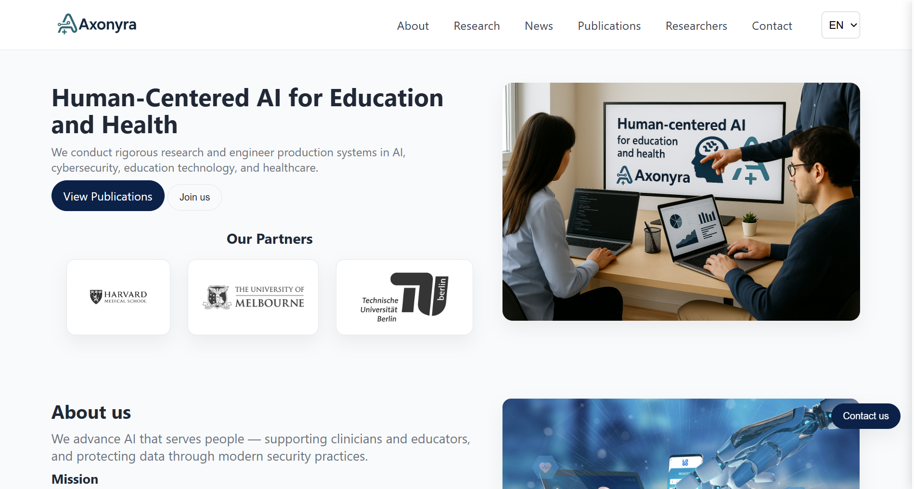

# Axonyra – Human-Centered AI Research Platform

## 📸 Preview 

<a href="https://axonyra.vercel.app/"><strong>➥ Live Demo</strong></a>

  

Axonyra is a lightweight, static research website developed using **HTML, CSS, and JavaScript**, dedicated to advancing **human-centered artificial intelligence** in **education, healthcare, and cybersecurity**.

The platform presents research activities, publications, partnerships, and ongoing projects, with an emphasis on the responsible design, evaluation, and deployment of AI systems.

---

## 🌍 Research Focus Areas

Axonyra operates across three primary research domains:

### 🎓 AI in Education
- Generative AI and learning outcomes  
- Cognitive skill trade-offs in AI-assisted learning  
- AI-supported assessment and feedback  
- Ethical and pedagogical implications of AI in higher education  

### 🏥 AI in Health
- AI-assisted clinical decision support  
- Health data analytics and risk prediction  
- Diagnostic and patient monitoring applications  
- Safety, reliability, and interpretability in medical AI  

### 🔐 AI & Cybersecurity
- Vulnerabilities in AI and machine learning systems  
- Adversarial attacks on large language models  
- AI robustness, security, and trustworthiness  
- Secure deployment of AI in critical environments  

---

## 🛠️ Technologies Used

This project is intentionally built using **core web technologies** to ensure simplicity, performance, and maintainability.

- **HTML5** – semantic markup  
- **CSS3** – responsive, mobile-first layout  
- **Vanilla JavaScript** – client-side interactivity  

No external frameworks or libraries are required.

---

## 📱 Features

- Fully responsive, mobile-first design  
- Clean and accessible user interface  
- Research-oriented content organization  
- Partner and affiliation showcase  
- Optimized for academic and professional audiences  

---

## 📂 Project Structure

/project-root  
├── index.html  
├── style.css  
├── script.js  
├── assets/  
│ ├── images/  
│ └── logos/  
└── README.md
